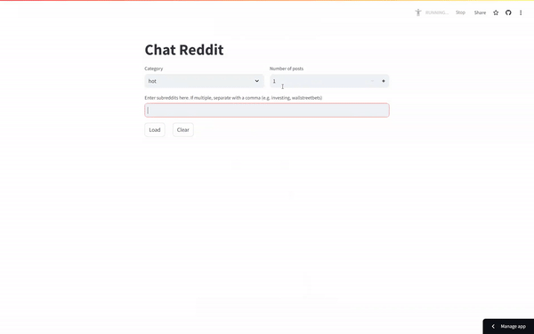

# chat-reddit
A conversational rag bot for subreddits.

A user can first choose a subreddit, the number of posts they'd like to load (and whether they would like these to be new, hot or top posts).

They can then have a conversation with these posts. Some suggested questions to start with:
- What are some common themes?
- What are people struggling with? 

The app is hosted [here](https://chattoreddit.streamlit.app/)

